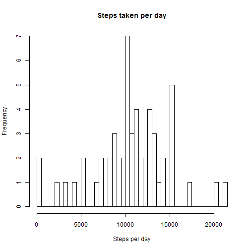
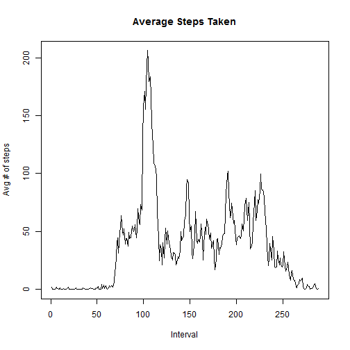
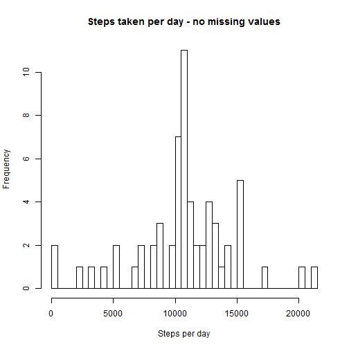
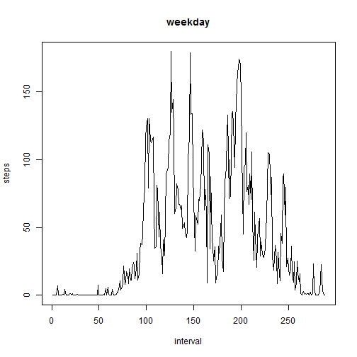
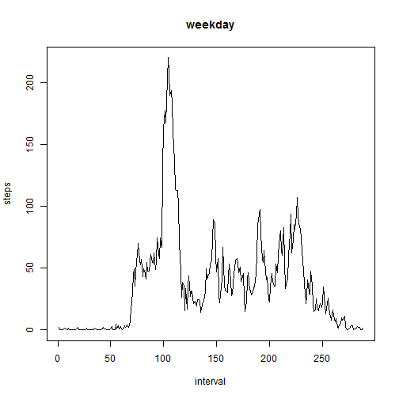

#Assignment

This assignment is for Coursera's Reproducible Research class.  We will be loading in fitness data and answering various questions by direct calcuations and plotting of the data.

#Loading and preprocessing the data

```r
library(knitr)
library(markdown)
```

```
## Warning: package 'markdown' was built under R version 3.1.3
```

```r
library(dplyr)
```

```
## Warning: package 'dplyr' was built under R version 3.1.3
```

```
## 
## Attaching package: 'dplyr'
## 
## The following object is masked from 'package:stats':
## 
##     filter
## 
## The following objects are masked from 'package:base':
## 
##     intersect, setdiff, setequal, union
```

```r
# load data
d <- read.csv("repdata_data_activity//activity.csv", colClasses = c("numeric", "character", "numeric"))

# convert date column to Date
d$date <- as.Date( d$date, format = "%Y-%m-%d")

# set data to factor (levels)
d$interval <- as.factor(d$interval)
```

##Q: What is mean total number of steps taken per day?

```r
spd <- aggregate( steps ~ date, d, sum)
hist(spd$steps, nrow(spd), main="Steps taken per day", xlab="Steps per day", ylab="Frequency")
```

 

```r
spd_mean <- mean(spd$steps, na.rm = TRUE)
spd_median <- median( spd$steps, na.rm = TRUE)
```

```
## [1] "Mean # of steps: 10766.188679"
```

```
## [1] "Median # of steps 10765.000000"
```


##Q: What is the average daily activity pattern?

Make a time series plot (i.e. type = "l") of the 5-minute interval (x-axis) and the average number of steps taken, averaged across all days (y-axis)


```r
d2 <- na.omit(d) # omit data that has NA values
ims <- d2 %>% group_by(interval) %>% summarize(mean_steps = mean(steps))
plot(ims$mean_steps, type="l", xlab="Interval", ylab="Avg # of steps", main="Average Steps Taken")
```

 

```r
max_steps <- ims[ which.max( ims$mean_steps), 1 ]
sprintf("Max number of steps ever taken: %i", as.numeric(max_steps))
```

```
## [1] "Max number of steps ever taken: 104"
```

##Q: Imputing missing values

```r
num_of_na_rows <- length(which(is.na(d)))
sprintf("Num of rows with NA values: %i", num_of_na_rows)
```

```
## [1] "Num of rows with NA values: 2304"
```

```r
v2 <- d;

# replace missing values with mean values
for (j in 1:nrow(v2)) {
  if (is.na( v2[j, "steps"]) == TRUE) {
  v2[j, "steps"] <- ims[ which( ims$interval == v2[j,"interval"]), 2]
  #print(v2[j,])
  }
}

spd2 <- aggregate( steps ~ date, v2, sum)
hist(spd2$steps, nrow(spd), main="Steps taken per day - no missing values", xlab="Steps per day", ylab="Frequency")
```

 

```r
spd2_mean <- mean(spd2$steps)
spd2_median <- median( spd2$steps)
```

```
## [1] "Mean # of steps: 10766.188679"
```

```
## [1] "Median # of steps 10766.188679"
```
##Q: Are there differences in activity patterns between weekdays and weekends?

```r
daytype <- function(date) {
  if (weekdays(date) %in% c("Sunday", "Sunday")) {
    "weekend"
  } else {
    "weekday"
  }
}

v2$daytype <- as.factor(sapply(v2$date, daytype))

# create plot

d3 <- aggregate(steps ~ interval, data = v2, subset = v2$daytype == "weekend", FUN = mean)
plot(d3$steps, type = "l", main = type,xlab="interval",ylab="steps")
```

 

```r
d4 <- aggregate(steps ~ interval, data = v2, subset = v2$daytype == "weekday", FUN = mean)
plot(d4$steps, type = "l", main = type,xlab="interval",ylab="steps")
```

 

